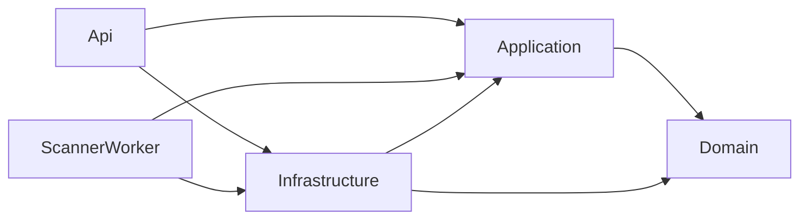

# Mimari Genel Bakış

Kaan.SecurityPlatform, Clean Architecture prensipleri ile ayrıştırılmış bir SaaS platformudur. Amaç, firmalara pasif ve zarar vermeyen kontrollerle sürekli güvenlik doktorluğu sağlamaktır.

## Katmanlar

- **Domain (`src/Kaan.SecurityPlatform.Domain`)** — Entity, enum, domain event ve value object tanımları. Framework bağımlılığı yok.
- **Application (`src/Kaan.SecurityPlatform.Application`)** — Iş kuralları, arayüzler (`IApplicationDbContext`, `IJwtTokenService`, `IPassiveSecurityCheck`, `IActivityEventPublisher`...), DTO'lar, validator ve mapper profilleri.
- **Infrastructure (`src/Kaan.SecurityPlatform.Infrastructure`)** — EF Core, ASP.NET Core Identity, JWT, Hangfire, SecureHttpClientFactory ve tüm servis implementasyonları.
- **Api (`src/Kaan.SecurityPlatform.Api`)** — REST controller'lar, SignalR `ActivityHub`, middleware ve Swagger yapılandırması.
- **ScannerWorker (`src/Kaan.SecurityPlatform.ScannerWorker`)** — Hangfire Server, arka plan tarama tüketicisi.
- **Frontend (`web/kaan-security-web`)** — Next.js 15 App Router, TypeScript, Tailwind. Auth için sunucu tarafı proxy (`/api/backend/*`) ve httpOnly cookie kullanır.

## Bağımlılık yönü

## Kritik akışlar

- **Kayıt / onay**: `POST /api/auth/register` → `Pending` üye + `PendingApproval` firma → admin `POST /api/admin/users/{id}/approve` → JWT refresh sonrası `Approved` claim ile normal işlemlere erişim.
- **Tarama**: `POST /api/scans` → `ScanJob` DB'ye yazılır → `IScanQueue` Hangfire'a enqueue eder → `PassiveScanExecutor` Worker tarafından çalıştırılır → `ScanResult`, `Finding[]`, `Notification`, SignalR `scan.completed`.
- **Yeniden test**: `POST /api/scans/retest` → önceki `Finding`'e bağlı yeni `ScanJob` başlatılır, sonuçta `RetestComparison` yazılır.
- **Bilgi Bankası**: `KnowledgeCategory` + `KnowledgeArticle` + `KnowledgeMediaAsset` + `FindingKnowledgeLink`. Yayın öncesi admin panelinden yönetim, medya `IFileStorage` üzerinden `wwwroot/uploads/knowledge/` altına.
